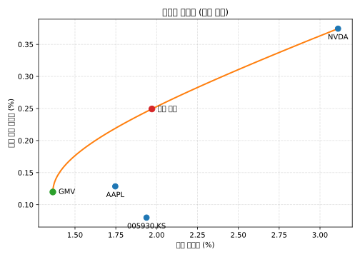

# 주식 데이터 분석 개요

이 저장소는 `temp.csv`에 포함된 삼성전자(005930.KS), 애플(AAPL), 엔비디아(NVDA)의 일별 시세 데이터를 분석한 결과를 정리합니다. CSV 파일은 3줄짜리 헤더 구조를 가지며, Python의 `csv` 모듈과 `pandas`를 활용해 분석에 적합한 형태로 가공한 뒤 통계 요약과 평균-분산(Mean-Variance) 최적화를 수행했습니다.

## 데이터 개요
- **기간:** 2023년 10월 16일부터 2025년 10월 10일까지 총 516거래일.
- **스키마:** 첫 번째 헤더는 가격 필드, 두 번째 헤더는 종목 티커가 배치된 3행 헤더 구조입니다. 두 헤더를 결합해 `AAPL_Close`, `NVDA_Volume`과 같은 열 이름을 생성했습니다.
- **결측 처리:** 모든 종목의 종가가 존재하는 행만 남기면 465개가 남고, 수익률 계산을 위해 전일 데이터가 필요한 조건을 적용하면 424개의 일별 수익률이 공통으로 남습니다.
- **단위:** 삼성전자는 KRW, 애플과 엔비디아는 USD로 가격이 표기되며, 거래량은 주식 수 기준입니다.

## 요약 통계
각 종목별 필드에 대해 최소값, 평균값, 최대값을 계산했습니다.

| 티커 | 항목 | 최소 | 평균 | 최대 |
| ---- | ----- | ---: | ---: | ---: |
| 005930.KS | Close | 48,968.97 | 66,471.53 | 94,400.00 |
| 005930.KS | High | 50,784.92 | 67,202.08 | 94,500.00 |
| 005930.KS | Low | 48,968.97 | 65,822.65 | 92,700.00 |
| 005930.KS | Open | 49,263.38 | 66,509.00 | 94,000.00 |
| 005930.KS | Volume | 2,957,915.00 | 19,481,204.69 | 57,691,266.00 |
| AAPL | Close | 163.82 | 209.52 | 258.10 |
| AAPL | High | 165.21 | 211.47 | 259.24 |
| AAPL | Low | 162.91 | 207.33 | 256.72 |
| AAPL | Open | 164.17 | 209.29 | 257.99 |
| AAPL | Volume | 23,234,700.00 | 56,558,297.39 | 318,679,900.00 |
| NVDA | Close | 40.30 | 115.60 | 192.57 |
| NVDA | High | 40.85 | 117.54 | 195.62 |
| NVDA | Low | 39.21 | 113.41 | 191.06 |
| NVDA | Open | 40.43 | 115.59 | 193.51 |
| NVDA | Volume | 105,157,000.00 | 325,122,504.81 | 1,142,269,000.00 |

## 일별 수익률 특성
공통 424거래일 구간에서 종가 기준 단순 일별 수익률을 계산했습니다.

| 티커 | 평균 일별 수익률 | 일별 변동성 |
| ---- | ----------------: | ---------------: |
| 005930.KS | 0.080% | 1.94% |
| AAPL | 0.129% | 1.75% |
| NVDA | 0.375% | 3.11% |

엔비디아는 평균 수익률이 0.38%로 가장 높지만 일별 변동성이 3% 수준으로 애플의 두 배, 삼성전자의 1.5배 이상입니다.

## 종목 간 상관관계
동일한 424거래일 구간에서 피어슨 상관계수를 계산했습니다.

| 조합 | 상관계수 |
| ---- | ----------: |
| 005930.KS ↔ AAPL | 0.119 |
| 005930.KS ↔ NVDA | 0.096 |
| AAPL ↔ NVDA | 0.404 |

삼성전자와 미국 상장사 간의 상관관계가 낮아 분산투자 효과를 제공하며, 애플-엔비디아 조합은 미국 기술주 사이의 연동성이 더 높게 나타납니다.

## 눈에 띄는 거래량 급증
- **005930.KS:** 2024년 1월 11일 5,769만 주 거래, 종가 ₩70,794.53.
- **AAPL:** 2024년 9월 20일 3억 1,868만 주 거래, 종가 $227.14.
- **NVDA:** 2024년 3월 8일 11억 4,227만 주 거래, 종가 $87.49.

해당 시점들은 실적 발표나 거시 이벤트와 맞물려 일시적으로 유동성이 크게 증가했습니다.

## 효율적 투자선(Efficient Frontier)
424개의 일별 수익률을 기반으로, 무위험 수익률을 0으로 두고 롱온리(long-only) 제약을 적용한 평균-분산 최적화를 수행했습니다. 아래 그림은 효율적 투자선과 글로벌 최소분산(GMV) 포트폴리오, 최대 샤프 포트폴리오를 함께 시각화합니다.



주요 포트폴리오 구성은 다음과 같습니다.

- **GMV 포트폴리오:** 삼성전자 43.2%, 애플 51.7%, 엔비디아 5.0%로 구성되어 일별 기대수익률 0.12%, 변동성 1.36%를 기록합니다.
- **최대 샤프:** 삼성전자 22.2%, 애플 24.2%, 엔비디아 53.5%로 구성되며 일별 기대수익률 0.25%, 변동성 1.97%를 제공합니다.
- **투자선 특성:** 변동성이 낮은 구간에서는 삼성전자와 애플 비중이 높고, 기대수익률을 높일수록 엔비디아 비중이 빠르게 증가하면서 투자선이 위쪽으로 만곡됩니다.

## 재현 방법
`pandas`, `numpy`, `matplotlib`를 설치한 뒤 아래 명령을 실행하면 표와 SVG를 재생성할 수 있습니다.

```bash
pip install pandas numpy matplotlib
python analysis.py
```

`analysis.py` 스크립트는 CSV 파싱, 통계 출력, 효율적 투자선 SVG 갱신을 자동으로 처리합니다.

## 웹 대시보드
`index.html`을 브라우저로 열면 핵심 통계, 거래량 급증 사례, 효율적 투자선 그래프를 한눈에 확인할 수 있는 정적 웹페이지가 표시됩니다. GitHub Pages에서 `docs` 폴더 없이 곧바로 제공할 수 있도록 저장소 루트에 HTML과 스타일시트를 배치했습니다.
